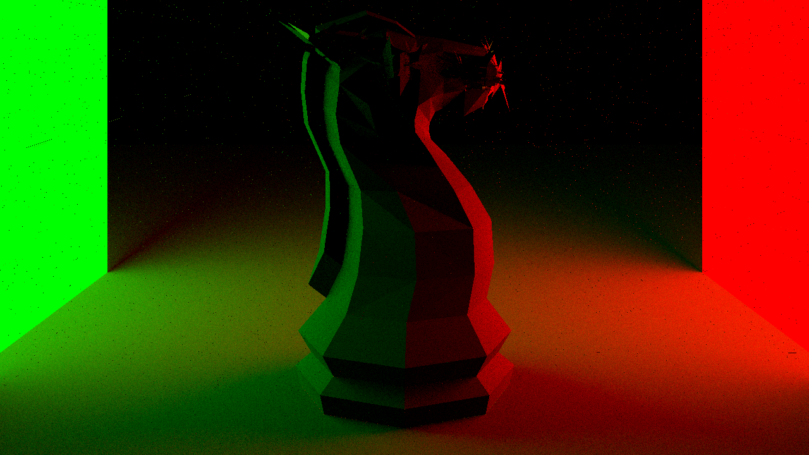

# 3D Render Engine

3D render engine project in C++.
Require a Nvidia graphic card to use CUDA acceleration.

## Dependencies

```bash
$ sudo apt install libpng-dev
$ sudo apt install nvidia-cuda-toolkit
$ sudo apt-get install libsdl2-dev
```

## Compilation

```bash
$ make all
```

## Execution

```bash
$ make run
```

## Some results


CUDA render almost 40 times faster than classic CPU render



Took 2924.65s to render (64 samples per ray and 4 threads per ray)


Took 614.99s to render (128 samples per ray and 1 threads per ray)


Took 20.15s to render (128 samples per ray and 1 threads per ray) Using CUDA BVH.

Maxence Leguéry
